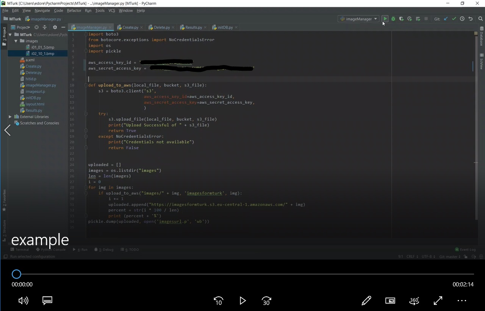

# ImageQualityAmazonMTurk

## Come utilizzare il codice:
* Trascinare nella cartella 'images' le immagini che si intende far valutare su Amazon MTurk.
* Eseguire il modulo Create.py per creare un numero di HITs pari alle immagini trascinate nella cartella images. Le HITs vengono assegnate a 5 utenti differenti da Amazon tramite il parametro MaxAssignments = 5 e non possono essere valutate più di una volta da parte di uno stesso utente.
* Eseguire il modulo Results.py per ricevere i risultati delle immmagini per ognuno dei 5 Worker che le hanno valutate, fino a che non vi sono almeno 3 Workers che hanno sottomesso un assignment non si inseriscono i risultati nel DB MinAssignments = 3.
* [Opzionale] il modulo Delete.py serve ad eliminare le HITs appena create
* [Opzionale] se si intende creare nuove HITs basta trascinare altre immagini nella cartella ed eseguire di nuovo Create.py, in automatico verrà capito quali sono le nuove immagini da far valutare.

Il modulo initDB.py serve ad inizializzare il database mySQL in localhost per ricevere i dati dalla piattaforma.
Le colonne del DB sono: worker id, età, sesso, qualità immagine, risoluzione schermo (acquisita automaticamente).

Il modulo imageManager.py viene chiamato da Create.py per caricare sul bucket S3 le immagini nella cartella images.

### Video Example:

Nel video si valutano inizialmente 2 HITs con 3 account differenti, si mostra che sono necessarie almeno 3 valutazioni di una immagine affinchè vengano inserite nel DB. Si aggiunge in un secondo momento una terza immagine e si esegue Create.py, i Workers hanno così a disposizione una nuova HIT collegata alle precedenti. 

## License
[Edoardo Re](https://github.com/edoardore), 2019

